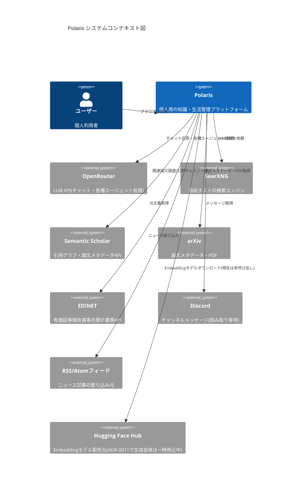
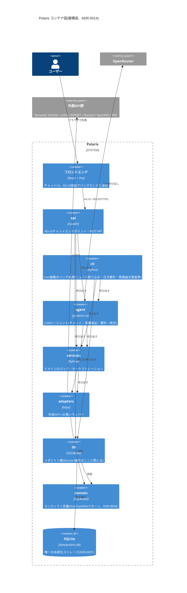

# アーキテクチャ概要

ADR-0014「ドキュメントの鮮度維持方針」に基づき、更新頻度が低い前提でMermaidのC4図を1枚だけ置く。手動更新の文書なので、大幅な構成変更があったときだけ描き直す(コード変更のたびに追従させる対象ではない)。

コード側の実際の依存関係(どのモジュールがどのモジュールをimportしてよいか)は、この図の「解説」ではなく`pyproject.toml`の`[tool.importlinter]`契約がCIで強制する一次情報。詳細な最新のテーブル定義は`docs/erd.md`(自動生成、ADR-0014)を参照。

## コンテキスト図

Polarisを1つの箱として、ユーザーと外部システムとの関係だけを示す。

## コンテナ図

Polaris内部の主要コンテナと、`import-linter`で強制している層構造(`cli`/`api` → `agent` → `services` → `adapters`/`db` → `domain`)を示す。`polaris.settings`/`polaris.progress`はどの層からも参照される横断的なユーティリティのため、層構造そのものには含めていない(図でも省略)。

`adapters`と`db`は互いをimportしない兄弟レイヤー(どちらも`domain`のみに依存する)。`services`は`agent`が定義するProtocol型(`PaperStructurer`等)を型注釈としてのみ参照することがあるが、実行時のimportではないため層構造上の違反ではない(`pyproject.toml`の`ignore_imports`に個別列挙して明示している)。
