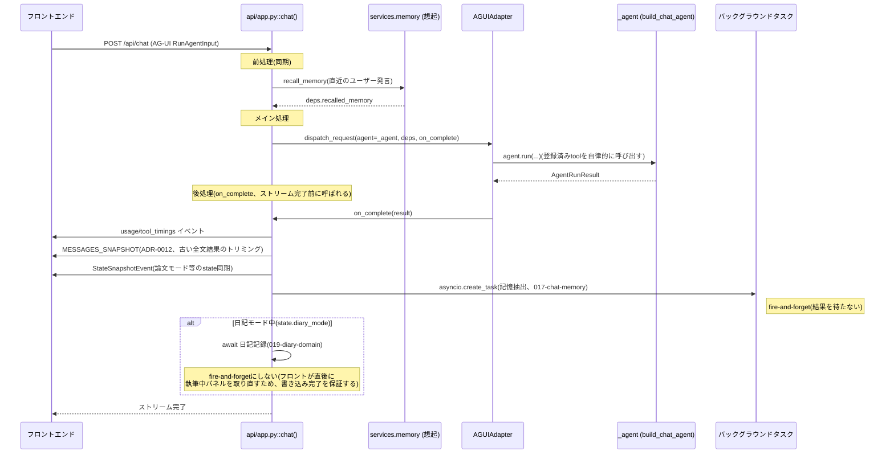

# チャットエージェントの全体像

ADR-0014の改訂(2026-09-13)で例外的に常設ドキュメント化した1枚。個別アクション(特定のツール1回分の詳細な呼び出し順など)はここには含めない — それは引き続き使い捨てで、必要になった都度その場でMermaidシーケンス図を出す運用のまま(ADR-0014 項目3参照)。ここに書くのは「チャットエージェント」という機能そのものの骨格、つまり①1ターンの処理パイプライン(ADR-0003)と②tool登録の仕組み(ADR-0013)の2つだけ。

この2つは実装済みの決定事項(ADR-0003/0013)に基づいており、変更頻度が低い(`api/app.py`の`chat()`関数の段構成自体や、`agent/chat_agent.py`のtool集約の仕組みは、個々のtoolが増減しても骨格は変わらない)。ただし完全な鮮度保証は無いので、大きな構成変更をしたら描き直すこと(`docs/erd.md`のような自動生成ではない、手動更新の文書)。

## ① 1ターンの処理パイプライン(ADR-0003、`POST /api/chat`)

要点(2026-09-13時点の`api/app.py::chat()`と一致):

- **前処理は同期**: 記憶想起(`recall_memory`)はメインのエージェント実行より前に必ず完了させ、`deps.recalled_memory`としてメイン処理に渡す
- **メイン処理は不変**: `_agent`(`build_chat_agent()`で組み立て済み)をそのまま`AGUIAdapter.dispatch_request`に渡すだけ
- **後処理内でも同期/非同期が混在する**: 記憶抽出(017)は結果を即座に必要とするUIが無いため`asyncio.create_task`でfire-and-forget。日記記録(019)は逆に、フロントがストリーム完了直後にDBを読みに行く設計のため`await`して書き込み完了を保証してから返す(レースコンディション回避、`_record_diary_task`のdocstring参照)

## ② tool登録の仕組み(ADR-0013、`agent/chat_agent.py`)

```mermaid
flowchart LR
    subgraph domain["agent/tools/&lt;domain&gt;.py(ドメインごとに1ファイル)"]
        paper["paper.py<br/>save_paper/list_papers"]
        paper_qa["paper_qa.py<br/>get_paper_full_text/exit_paper_mode"]
        paper_research["paper_research.py<br/>research_related_papers"]
        todo["todo.py<br/>TODOの読み書き"]
        news["news.py<br/>list_news"]
        ir["ir.py<br/>IR文書"]
        diary["diary.py<br/>日記モード"]
        memory["memory.py<br/>動的instructions"]
        web_search["web_search.py<br/>web_search"]
    end

    domain -->|"各モジュールのINSTRUCTIONS文字列"| concat["chat_agent.py: _INSTRUCTIONS<br/>(全ドメイン分を連結)"]
    domain -->|"各モジュールのregister(agent, ...)"| build["build_chat_agent()"]
    concat --> build
    build --> agent["Agent[ChatDeps, str]<br/>(pydantic-ai)"]
```

要点:

- **1ドメイン1ファイル**が規約(`agent/tools/<domain>.py`)。各ファイルが持つのは (a) tool関数本体、(b) LLMに渡す`INSTRUCTIONS`文字列(モジュール定数)、(c) 必要なら`@agent.instructions`の動的instructions関数
- `chat_agent.py::build_chat_agent()`は薄い集約役に徹する: 全ドメインの`INSTRUCTIONS`を連結して`Agent`を1つ作り、各ドメインの`register(agent, ...)`を呼ぶだけ
- toolを1つ追加するときに触る箇所は3つだけ: 新規`tools/<domain>.py`・`chat_agent.py`のimport行・`_INSTRUCTIONS`連結と`register`呼び出し
- `@agent.tool_plain`(depsに触れない)と`@agent.tool`(`RunContext[ChatDeps]`経由でstateを読み書きする、例: 論文モードの`active_paper`)の使い分けは各ドメインファイル側の判断

現在登録されているドメイン(2026-09-13時点、`agent/chat_agent.py`参照): `memory`・`paper`・`todo`(読み書き分離)・`paper_qa`・`paper_research`・`web_search`・`news`・`ir`・`diary`、加えてpydantic-ai同梱の`web_fetch_tool()`。

## ③ 現在登録されているtool一覧

個々のtoolはドメインが増えるたびに変わる(=変更頻度が高い)ため、①・②と違って常設ドキュメント化しない(ADR-0014と同じ判断)。`uv run python scripts/audit_agent_tools.py`をオンデマンドで実行して最新の一覧を得ること。

## 関連

- ADR-0003(チャットターンの3段パイプライン)、ADR-0012(このドキュメントの後処理段が触れる履歴トリミング)、ADR-0013(tool登録のドメイン分割)
- `ARCHITECTURE.md`(C4図、`agent`コンテナが`services`/`adapters`をどう呼ぶかという層構造の全体像)
