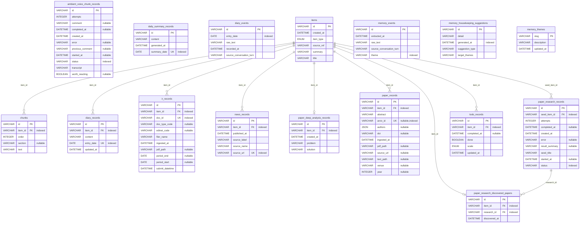

# ER図

`domain/entities.py`のSQLModelから`paracelsus`で自動生成する(ADR-0014)。コード変更のたびに手で更新する文書ではなく、`uv run nox -s erd`で再生成すること(通常の`uv run nox`にも組み込まれている)。手動で編集しないこと。

<!-- BEGIN_SQLALCHEMY_DOCS -->

<!-- END_SQLALCHEMY_DOCS -->
