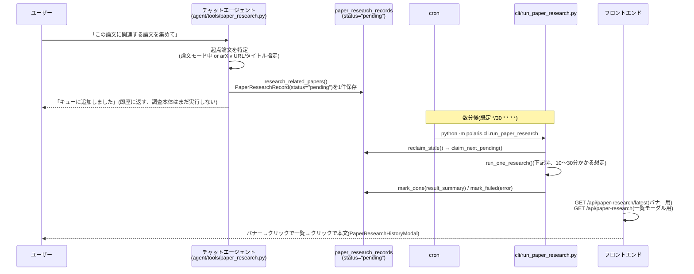
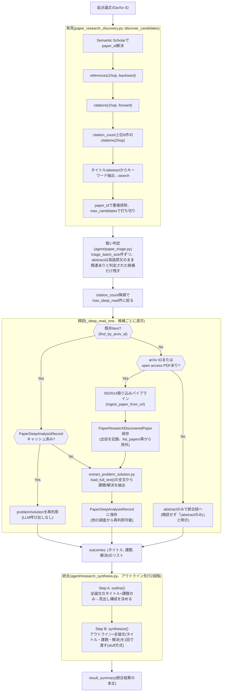

# 関連論文調査(027)の全体像

ADR-0014の「あるアクションでドメインモデルがどう経由・変化するか」は原則オンデマンド生成・使い捨て(項目3)だが、`docs/chat-agent-flow.md`と同じ理由でこの1本だけ例外的に常設ドキュメント化する: 027は複数ファイル(チャット側のtool・cron駆動のCLI・既存の002/014取り込みパイプライン・複数の新規エージェント)にまたがる非同期バッチ処理で、開発者が現状を把握するまでの負荷が高い。骨格(受付をキューに積むだけにする/CLIバッチが発見→triage→精読→統合を順に行う、という段構成自体)はユーザーストーリー1の実装で固定化されており(`specs/027-related-paper-research/spec.draft.md`参照)、個々のtool一覧のように変更頻度が高いものではない。

完全な鮮度保証は無い手動更新の文書。段構成やファイル配置を変えたら描き直すこと。詳細な仕様・設計判断の理由は`specs/027-related-paper-research/spec.draft.md`が一次情報で、このページは実装済みコードの見取り図に徹する。

## ① 受付(チャットターン、同期)とバッチ実行(cron、非同期)は別プロセス

要点:

- チャット側のtool(`research_related_papers`)は`PaperResearchRecord`を1行作るだけで、発見・精読・統合は一切行わない(`agent/tools/todo.py`の`add_todo`と同じ軽さ)。数分〜数十分かかる処理を同期チャットターンに収めないための設計(`specs/IDEAS.md`)
- 実処理は008/023/024と同じ「OS cron駆動のCLI」パターン(`cli/run_paper_research.py`)。FastAPIサーバーの生存に依存せず、Engine/Repository/Agentを自前で組み立てる
- 完了通知は023と同じ「バナー→クリックで展開」パターンだが、027では「最新1件のバナー→一覧モーダル→詳細」の3段(`PaperResearchBanner.tsx`→`PaperResearchList.tsx`→`PaperResearchHistoryModal.tsx`)。チャット履歴には追加しない

## ② `run_one_research()`の内部(1調査依頼ぶん、`services/paper_research.py`)

要点:

- 発見・精読は全て**逐次**実行(`asyncio.gather`は使わない)。無料枠LLM/Semantic Scholarの同時実行は非決定的に落ちることが021/027の実機検証で分かっているため
- Semantic Scholarへの全リクエストは`adapters/semantic_scholar/client.py`の`_get_with_retry()`を経由し、指数バックオフ(429/5xx/ネットワークエラーをリトライ、`Retry-After`優先)を必須で掛ける
- embeddingは生成しない(ADR-0011)。精読は全文取り込み(ベクトル検索は使わない)方式
- 統合は当初「refine」方式(1論文ずつ`fold()`)だったが、序盤の論文情報が圧縮で失われる問題があり、2026-09-13にアウトライン先行の2段階に変更した(詳細は`specs/027-related-paper-research/spec.draft.md`「改善: 統合結果が薄い問題」参照)
- 調査で新規に取り込んだ論文(`PaperResearchDiscoveredPaper`)は`list_papers`/論文一覧UI/日次要約から除外される。ユーザーが後から`save_paper`で明示的に保存し直すと出自が外れ、通常のライブラリの一員として扱われる
- 1件の失敗(`run_one_research`の例外)はバッチ全体を止めず`mark_failed`にして次回再試行する(008/023と同じ方針)

## 関連

- 一次情報: `specs/027-related-paper-research/spec.draft.md`(データモデル・設定値・未決定事項の解決経緯まで含む)
- ADR-0011(Ingest時Embedding生成の一時停止、027が全面適用した)、ADR-0014(このドキュメントの位置づけ)
- `docs/chat-agent-flow.md`(チャットエージェント全体の骨格、①の`Chat`部分の詳細)
